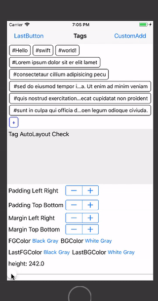
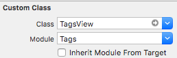
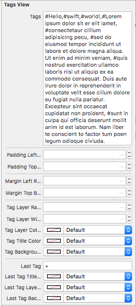
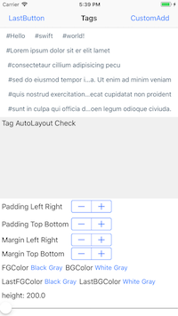
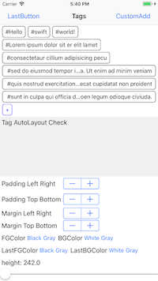
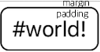

# Tags

[](http://cocoapods.org/pods/Tags)
[](http://cocoapods.org/pods/Tags)
[](http://cocoapods.org/pods/Tags)
[](https://developer.apple.com/swift/)

## Introduce

dynamically add, modify, and delete tags, and you can easily change the margins, colors, and fonts of your tags.
Tags are not broken because they are linked with Auto Layout.
Each time the height of the tag changes, you can bring the height to the delegate





## Requirements

`Tags` written in Swift 4. Compatible with iOS 8.0+

## Installation

### Cocoapods

Tags is available through [CocoaPods](http://cocoapods.org). To install
it, simply add the following line to your Podfile:

```ruby
pod 'Tags'
```

## Usage


### Xib or Storyboard file

setting





view

 


done!

<br><br><br>

### Code editor

```swift
import Tags
```

```swift
let tagView = TagsView()
self.view.addSubview(tagView)
```
AutoLayout Example

```swift
tagView.translatesAutoresizingMaskIntoConstraints = false
self.view.addConstraint(NSLayoutConstraint(
    item: self.view,
    attribute: .leading,
    relatedBy: .equal,
    toItem: tagView,
    attribute: .leading,
    multiplier: 1,
    constant: 0)
)
self.view.addConstraint(NSLayoutConstraint(
    item: self.view,
    attribute: .trailing,
    relatedBy: .equal,
    toItem: tagView,
    attribute: .trailing,
    multiplier: 1,
    constant: 0)
)
self.view.addConstraint(NSLayoutConstraint(
    item: self.view,
    attribute: .top,
    relatedBy: .equal,
    toItem: tagView,
    attribute: .top,
    multiplier: 1,
    constant: 0)
)
```

done!

<br><br><br>


### Property

tags

```swift
//Returned as an array of strings
tagsView.tagTextArray//get-only

//Returned as an array of TagButton
tagsView.tagArray//get-only
```

height

```swift
tagsView.height//get-only
```

padding & margin



```swift
tagsView.paddingLeftRight = 6
tagsView.paddingTopBottom = 4
tagsView.marginLeftRight = 6
tagsView.marginTopBottom = 4
```


tag

```swift
// layer radius
tagsView.tagLayerRadius = 6
// layer width
tagsView.tagLayerWidth = 1
// layer color
tagsView.tagLayerColor = .black
// text color
tagsView.tagTitleColor = .black
// background color
tagsView.tagBackgroundColor = .white
// font
tagsView.tagFont = .systemFont(ofSize: 15)
// text longer ...
tagsView.lineBreakMode = .byTruncatingMiddle
// tag add
tagsView.tags = "Hello,Swift"
```

lastTag

```swift
// lastTag title
tagsView.lastTag = "+"
// lastTag titleColor
tagsView.lastTagTitleColor = .black
// lastTag layer Color
tagsView.lastTagLayerColor = .black
// lastTag background Color
tagsView.lastTagBackgroundColor = .white
```

<br><br>

### Method

append

```swift
tagsView.append("Hello")
tagsView.append(contentsOf: ["Hello", "World"])
tagsView.append(TagButton())
tagsView.append(contentsOf: [TagButton(), TagButton()])
```

update

```swift
tagsView.update("Hi", at: 0)
tagsView.update(TagButton(), at: 0)
```

insert

```swift
tagsView.insert("World", at: 0)
tagsView.insert(TagButton(), at: 0)
```

remove

```swift
tagsView.remove(0)
tagsView.remove(TagButton())
tagsView.removeAll()
```

lastTag

```swift
// lastTag Button
tagsView.lastTagButton(TagButton())
```

redraw

```swift
// ReDraw
tagsView.redraw()
```

<br><br>

### Delegate

```swift
class ViewController: UIViewController{
    override func viewDidLoad() {
        super.viewDidLoad()
        
        let tagsView = TagsView()
        tagsView.delegate = self
    }
}

extension ViewController: TagsDelegate{

    // Tag Touch Action
    func tagsTouchAction(_ tagsView: TagsView, tagButton: TagButton) {
    
    }
    
    // Last Tag Touch Action
    func tagsLastTagAction(_ tagsView: TagsView, tagButton: TagButton) {
    
    }
    
    // TagsView Change Height
    func tagsChangeHeight(_ tagsView: TagsView, height: CGFloat) {
    
    }
}

```

<br><br>

### Customize

TagButton Customize

```swift
let button = TagButton()
button.setTitle("Tag", for: .normal)
let options = ButtonOptions(
    layerColor: UIColor.black, // layer Color
    layerRadius: 6.0, // layer Radius
    layerWidth: 1.0, // layer Width
    tagTitleColor: UIColor.black, // title Color
    tagFont: UIFont.systemFont(ofSize: 15), // Font
    tagBackgroundColor: UIColor.white, // Background Color
    lineBreakMode: NSLineBreakMode.byTruncatingMiddle //break Mode
)
button.setEntity(options)
tagsView.append(button)
```

LastTagButton Customize

```swift
let button = TagButton()
button.setTitle("Tag", for: .normal)
let options = ButtonOptions(
    layerColor: UIColor.black, // layer Color
    layerRadius: 6.0, // layer Radius
    layerWidth: 1.0, // layer Width
    tagTitleColor: UIColor.black, // title Color
    tagFont: UIFont.systemFont(ofSize: 15), // Font
    tagBackgroundColor: UIColor.white, // Background Color
    lineBreakMode: NSLineBreakMode.byTruncatingMiddle //break Mode
)
button.setEntity(options)
tagsView.lastTagButton(TagButton())
```


## Author

pikachu987, pikachu77769@gmail.com

## License

Tags is available under the MIT license. See the LICENSE file for more info.
